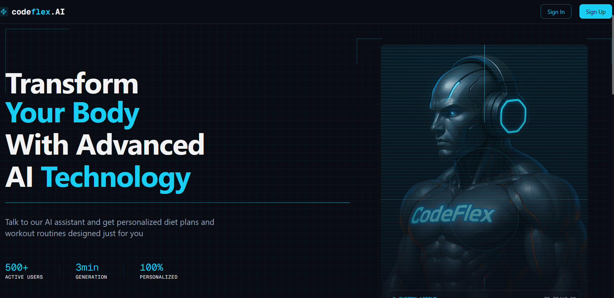

# Codeflex
Codeflex is a AI fitness trainer that helps you improve your health and fitness by providing you with a personalized workout plan based on your fitness goals.

## Key Features
🚀 Tech stack: Next.js, React, Tailwind & Shadcn UI

🔒 Authentication & Authorization (Clerk)

🎙️ Voice AI Assistant (Vapi)

💾 Database (Convex)

🧠 LLM Integration (Gemini AI)

## Vapi Workflow Diagram


## Convex Database 
- **Install command:** 
  ```
  npm install convex
  ```
- **Set up a Convex dev deployment:**
  ```
  npx convex dev
  ```
- **Configure Convex with Clerk for authentication and authorization:**
- **Create Schema**

## Web Hooks
- Automated message that are sent when something happens.
- Using `svix` library for verifying webhooks.
  ```
  npm install svix
  ```

  ### Clerk Integration with Convex
  

## Gemini AI Integration
- Create a Gemini AI account and get the API key.
  [Link to Gemini AI Studio](https://aistudio.google.com/apikey)
- Setup the Gemini API key in the environment variables of the convex, bez convex is used as backend.
- **GenAI Install command:** 
    ```
    npm install @google/generative-ai
    ```